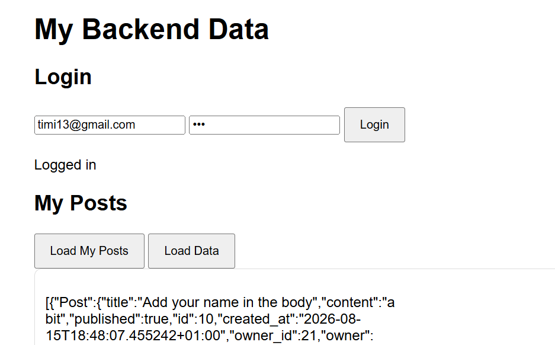

# FastAPI Login & Posts Viewer

A vanilla JavaScript frontend that connects to a FastAPI backend with OAuth2 authentication.

## Features
- Login form authenticating against a FastAPI backend
- JWT token stored and used for authenticated requests
- Fetches and displays the logged-in user's posts

## Tech Stack
- **Frontend**: HTML, CSS, JavaScript (Fetch API, Async/Await)
- **Backend**: FastAPI, OAuth2 with Password Bearer, Uvicorn, SQLite/SQLAlchemy

## Screenshot

